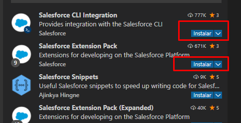
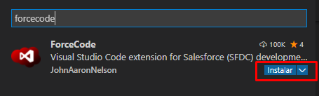
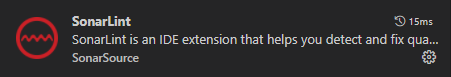
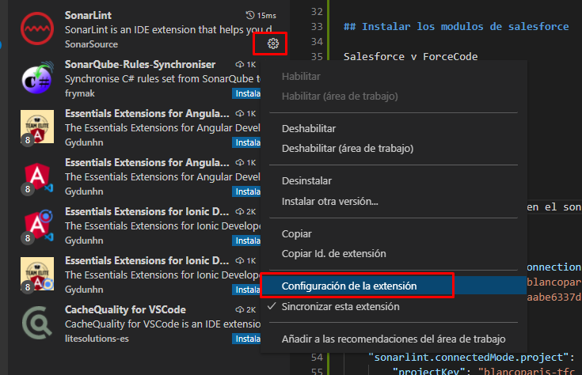

# ejemploSaleforce

# Instalacion del escaner

https://forcedotcom.github.io/sfdx-scanner/en/getting-started/install/#upgrade-plug-in


* sfdx plugins:install @salesforce/sfdx-scanner
* sfdx plugins


# Inicio de la instalación IDE (SalesForce/sonarLint)

## Instalar los modulos de salesforce

Salesforce y ForceCode







## Configuramos el sonar lint

Esta información la obtenemos en el sonarcloud.

``` json
    "sonarlint.connectedMode.connections.sonarcloud": [
        { "organizationKey": "blancoparis-tfc", "token": "d0f3585f60937f0263dd909f1cbd5a7c7d975049" }
        ]
    ,
    "sonarlint.connectedMode.project": {
            "projectKey": "blancoparis-tfc_ejemploSaleforce"
    }
```

